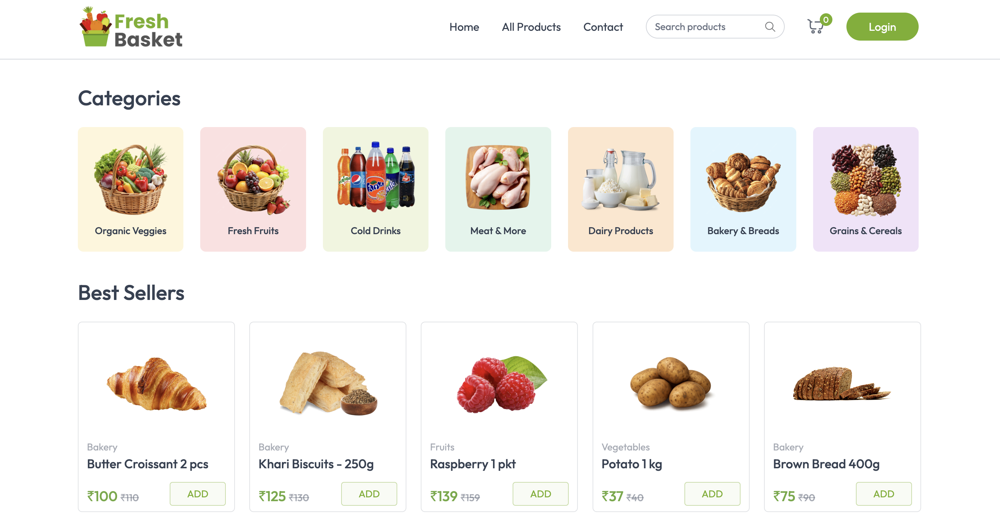
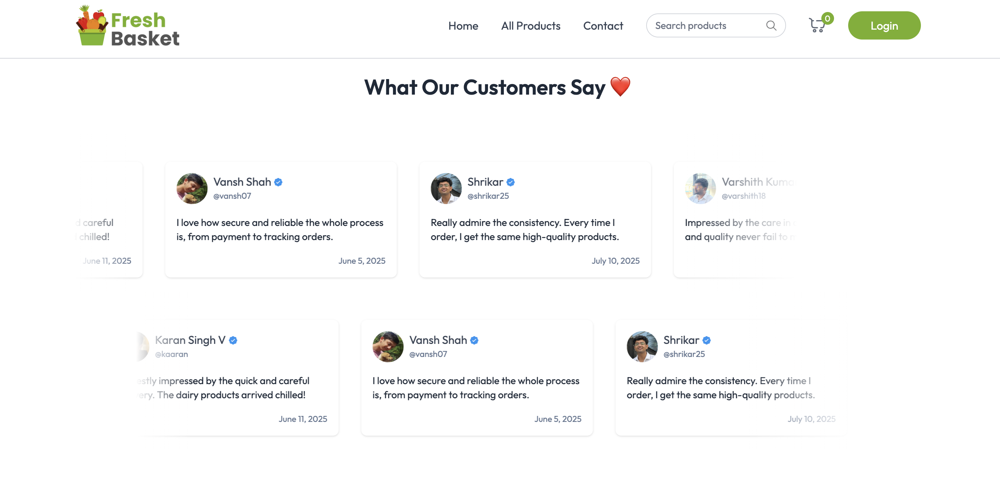

# Fresh Basket – Full Stack Grocery E-commerce Website

Fresh Basket is a modern, full-stack grocery e-commerce application built using the MERN stack (MongoDB, Express.js, React, Node.js). This is a fully responsive, clean, and intuitive web app designed to simulate a real-world online grocery shopping experience. It includes user authentication, product browsing by category, cart management, order placement, and visual polish tailored for a delightful UX.

---

## 🌐 Live Demo

[Live Link to Website](https://fresh-basket-mu.vercel.app/) ✨

---

## 🌱 Project Description

Fresh Basket allows users to:

* Register/login with optional profile picture uploads
* Browse products by category: Fruits & Vegetables, Bakery, Dairy, Grains, Meat, and Drinks
* View sections like Best Sellers, Farm Fresh, and customer Testimonials
* Add products to the cart
* Place orders using COD or Online Payment
* Make dummy online payments through Stripe
* Access responsive UI/UX across all devices

---

## 🧰 Technologies & Libraries Used

### Frontend:

* **React.js** (CRA)
* **Tailwind CSS** (for utility-first styling)
* **React Router DOM**
* **Axios** (API requests)
* **React Hot Toast** (notifications)
* **Framer Motion** (animations)

### Backend:

* **Node.js & Express.js**
* **MongoDB with Mongoose ODM**
* **JWT** (Authentication)
* **bcrypt.js** (Password hashing)
* **cookie-parser**
* **Cloudinary** (Image upload)
* **Multer & multer-storage-cloudinary** (Handling user profile image uploads)

---

## 🛁 Folder Structure (Simplified)

```
client/
└── src/
    ├── assets/            # Images and SVGs
    ├── components/        # UI components (Navbar, Footer, ProductCard, etc.)
    ├── context/           # App-wide context provider
    ├── pages/             # Main pages (Home, Login, etc.)
    ├── App.js             # Routes setup
    └── main.jsx           # Entry point

server/
├── controllers/           # Controller logic (user, product)
├── middleware/            # Auth & Multer middleware
├── models/               # Mongoose Schemas
├── routes/               # Express Routers
├── .env                   # Environment variables
└── index.js               # Server entry point
```

---

## 🔹 Major Features Implemented

### ✅ Authentication:

* Register/login/logout using JWT cookies
* Profile picture upload using Cloudinary + Multer

### 🍇 Product Showcases:

* Dynamic product listing from categories
* **Best Sellers**, **Farm Fresh**, **Dairy Delights**, **Baker's Choice**, **Pantry Staples**, **Chill Zone**, and **From the Butcher**
* All product sections pick 5 random in-stock items per category on each reload

### 🛅 Testimonial Section:

* Custom user reviews displayed in a horizontal marquee animation

### 📢 Newsletter Component:

* Users can "subscribe" to newsletter and see a success alert (non-functional backend)

### 🌍 Responsive Design:

* Fully mobile-friendly with Tailwind breakpoints

### 🔹 Other Notable Components:

* Navbar with dynamic user profile
* Category Grid
* Dynamic Banners (Top + Bottom)
* Footer with important links

---

## 📷 Preview / Screenshots

* 
* 
* 

---

## 📁 How to Run Locally

### Backend Setup:

```bash
cd server
npm install
# Create .env file with:
# MONGO_URI=your_mongodb_url
# JWT_SECRET=your_secret_key
# CLOUDINARY_CLOUD_NAME=xxxx
# CLOUDINARY_API_KEY=xxxx
# CLOUDINARY_API_SECRET=xxxx
npm start
```

### Frontend Setup:

```bash
cd client
npm install
npm run dev
```

---

## 💌 Contact

**Made with ❤️ by Kushal J.**
For queries, reach out:

* Email: [kushalj400231@gmail.com](kushalj400231@gmail.com)
* LinkedIn: [https://www.linkedin.com/in/kushalj1/](https://www.linkedin.com/in/kushalj1/)

---

## 📅 Project Status

**Status:** ✅ Complete
More features (like order tracking, Profile Section etc.) to be added in the future.

---

> Thank you for visiting Fresh Basket! 🌿

---
